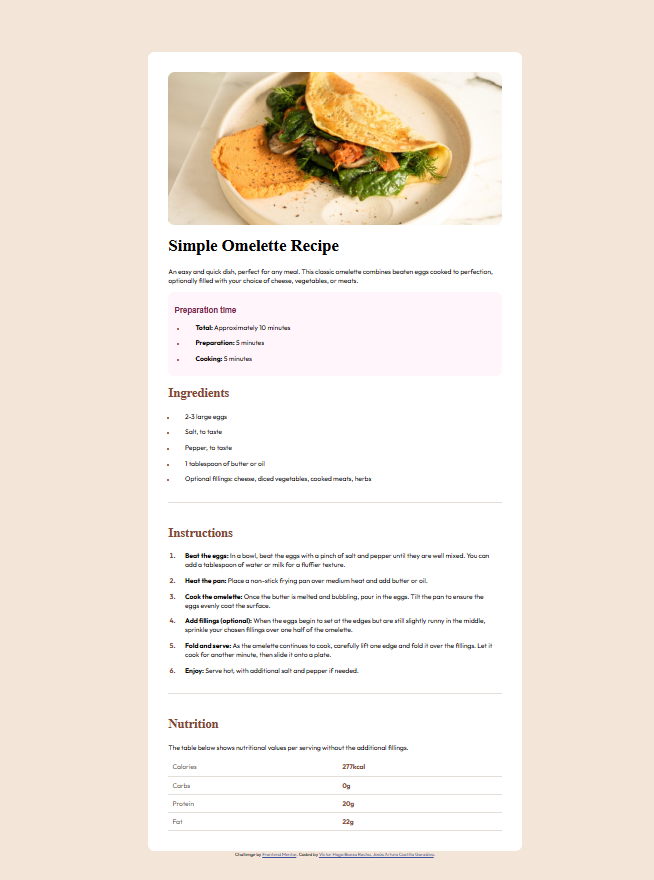

# Frontend Mentor - Recipe page solution

This is a solution to the [Recipe page challenge on Frontend Mentor](https://www.frontendmentor.io/challenges/recipe-page-KiTsR8QQKm). Frontend Mentor challenges help you improve your coding skills by building realistic projects. 

## Table of contents

- [Overview](#overview)
  - [The challenge](#the-challenge)
  - [Screenshot](#screenshot)
- [My process](#my-process)
  - [Built with](#built-with)
  - [What I learned](#what-i-learned)
  - [Continued development](#continued-development)
- [Author](#author)

## Overview

### Screenshot



## My process
Para realizar el codio, primero se estructuro el contenido en html, colocando cada texto en un h1, h2, p, tabla, li o segun lo que corresondiera.
Despues se implemento el codigo css para dar posición y estilo a cada contenedor.
Se utilizo el contenido de style-guide.md para saber que color usar en los contenedores y en cada tipo de texto.

### Built with

- Semantic HTML5 markup
- CSS custom properties
- Flexbox
- Mobile-first workflow

### What I learned

Una de las cosas que no teniamos claro, era la adaptación del código en diferentes tamaños de navegador
como lo son desktop y movil.
Para eso encontramos una propiedad en css que nos permitio saber cuando el ancho del navegador es mayor a 768
y de ser este el caso, tomaria la apariencia para desktop, en caso contrario se quedaria el codigo css en su formato
original para movil


Desktop
```css
@media (min-width: 768px) {
    .content {
        width: 40%;
        margin-top: 8rem;
        padding: 3rem;
    }

    img {
        border-radius: 1rem;
    }
}
```

Móvil
```css
.content {
    display: flex;
    flex-direction: column;
    justify-content: center;
    align-items: center;
    width: 100%;
    background-color: white;
    border-radius: 1rem;
    max-width: 800px;
}

img {
    width: 100%;
    margin: 0px;
    border: 0px;
    border-radius: 0rem;
}
```

Una cosa que no sabiamos antes de realizar este challenge era como modificar las biñetas en las listas,
investigando como cambiar el color de las biñetas y el tamaño:

Color de biñetas
```css
li::marker {
    color: hsl(14, 45%, 36%);
}
```

Tamaño
```css
ul li::marker{
    font-size: 0.8em;
}
```

### Continued development

Nos gustaria continuar desarrollando nuestras capacidades de programación web utilizando principalmente css y html. Con el tiempo tambien nos gustaria implementar JavaScript para dar funcionalidad a nuestras paginas. 

## Author

- Github - [Hugo Baeza](https://github.com/hugovfx)
- Github - [Asterion-J](https://github.com/Asterion-J) 
- Frontend Mentor - [@hugovfx](https://www.frontendmentor.io/profile/hugovfx)
- Frontend Mentor - [@Asterion-J](https://www.frontendmentor.io/profile/Asterion-J)

